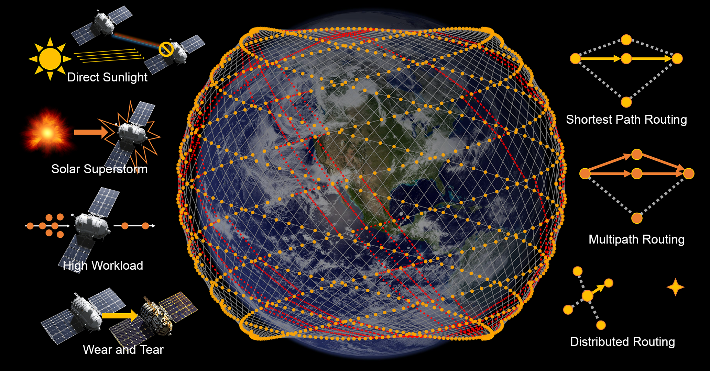

# ¿Qué tan resilientes son? Análisis de robustez del enrutamiento de satélites LEO | IWQoS 2025



Este es el código fuente para el artículo de IWQoS 2025 ["¿Qué tan resilientes son? Análisis de robustez del enrutamiento de satélites LEO.](https://ieeexplore.ieee.org/document/11143286)

Zijun Yang, Sheng Cen y Yifei Zhu

Instituto Conjunto UM-SJTU, Universidade de Shanghai Jiao Tong

---

En este trabajo, llevamos a cabo el primer análisis integral de robustez del enrutamiento de satélites LEO frente a cuatro amenazas críticas del entorno espacial: interferencia por luz solar directa, tormentas solares superactivas, congestión de carga de trabajo en latitudes altas y fallas por lotes de satélites debido al desgaste. Nuestros hallazgos revelan que los algoritmos de enrutamiento estático exhiben vulnerabilidades catastróficas, mientras que el enrutamiento distribuido dinámico mantiene la resiliencia de la red con un mínimo costo en latencia, proporcionando ideas fundamentales para el diseño de infraestructuras adaptativas de redes satelitales.

Utilizamos C++ para simular la constelación y exportar los resultados a archivos CSV. Luego, se utiliza Python para visualizarlos.

Puede encontrar algunos códigos no utilizados en Python, ya que originalmente estaba diseñado para usar Python únicamente para todo el trabajo, pero resultó ser demasiado lento para la escala de simulación que estamos realizando.

# Ejecutar el código - Simulación

Este proyecto utiliza CMake.

```bash
mkdir build
cd build
cmake ..
make break
make city
```

Los ajustes de la constelación están programados en `break.cpp` y `city.cpp`.

`break.cpp` se utiliza para simulaciones macroescópicas, a escala de constelación.

`city.cpp` se utiliza para simulaciones microscópicas de conectividad entre pares de ciudades.

Puede ejecutarlos directamente y seguir las indicaciones. Antes de ejecutar, debe configurar la subcarpeta como `/results/resultsXX/`.

# Ejecutar el código - Visualización

Los paquetes Python requeridos se encuentran en `requirements.txt`.

Los ajustes de la constelación están en `/config/`.

Antes de graficar cualquier simulación macroescópica a escala de constelación, debe ejecutar `python3 integrateCsv.py` para integrar los resultados.

## Graficar ISL y mapa 2D de satélites

```bash
python3 plotMap.py
```

Descomente el código de interrupción de ISL para graficar diferentes escenarios.

## Graficar la tasa de desconexión en el escenario de luz solar directa

```bash
python3 plotFailureRateWithTime.py
```

Descomente el código de `dirList` y `legends` para graficar diferentes configuraciones de desfase de fase.

Si desea visualizar sus propios resultados, cambie `dirList` al sufijo correspondiente de su resultado y ajuste las leyendas en consecuencia.

## Graficar la tasa de desconexión en los otros tres escenarios

```bash
python3 plotFailureRateWithISLFailureRate.py
```

Descomente el código de `dirList` y `legends` para graficar diferentes escenarios.

Si desea visualizar sus propios resultados, cambie `dirList` al sufijo correspondiente de su resultado y ajuste las leyendas en consecuencia.

## Graficar vista microscópica (conectividad entre pares de ciudades)

```bash
python3 plotCity.py
```

Para las gráficas que aparecen en el artículo, se utilizan los siguientes parámetros:

- Tormenta solar: `dir=95`, `only6000s=1`, y tasa de falla de ISL=`5`.
- Alta carga de trabajo: `dir=96`, `only6000s=1`, y tasa de falla de ISL=`5`.
- Desgaste: `dir=92`, `only6000s=0`, y tasa de falla de ISL=`5`.

Si desea visualizar sus propios resultados, ingrese el sufijo de su resultado y la tasa de falla de ISL. Si `only6000s` se establece en un valor diferente a `1`, intentará graficar todos los datos.

# Trampas

El programa utiliza un conjunto ligeramente diferente de terminología en comparación con el artículo.

El desfase de fase en el artículo es la diferencia de fase entre órbitas vecinas. Este parámetro en el programa (tanto en Python como en C++) se llama `offset`, y se multiplica por `-72` para que sea un número entero. Por ejemplo, un desplazamiento de `-11` en el programa es lo mismo que un desfase de fase de `11/72` en el artículo.

# Licencia

`all_in_one.csv` y `all_in_one_real_csv.csv` son datos procesados originalmente de Oakla Speedtest y las Naciones Unidas.

<a href="https://github.com/zpatronus/Robustness-Analysis-of-LEO-Satellite-Routing">Código fuente para el artículo "¿Qué tan resilientes son? Análisis de robustez del enrutamiento de satélites LEO"</a> © 2025 por <a href="https://zjyang.dev/">Zijun Yang</a> está licenciado bajo <a href="https://creativecommons.org/licenses/by/4.0/">CC BY 4.0</a>

# Formato de citación

Z. Yang, S. Cen y Y. Zhu, "¿Qué tan resilientes son? Análisis de robustez del enrutamiento de satélites LEO," en *Proc. IEEE/ACM International Symposium on Quality of Service (IWQoS)*, 2025.

```bibtex
@inproceedings{yang2025resilient,
  title={How Resilient Are They? Robustness Analysis of LEO Satellite Routing},
  author={Yang, Zijun and Cen, Sheng and Zhu, Yifei},
  booktitle={Proc. IEEE/ACM International Symposium on Quality of Service (IWQoS)},
  year={2025},
  publisher={IEEE/ACM}
}
```
