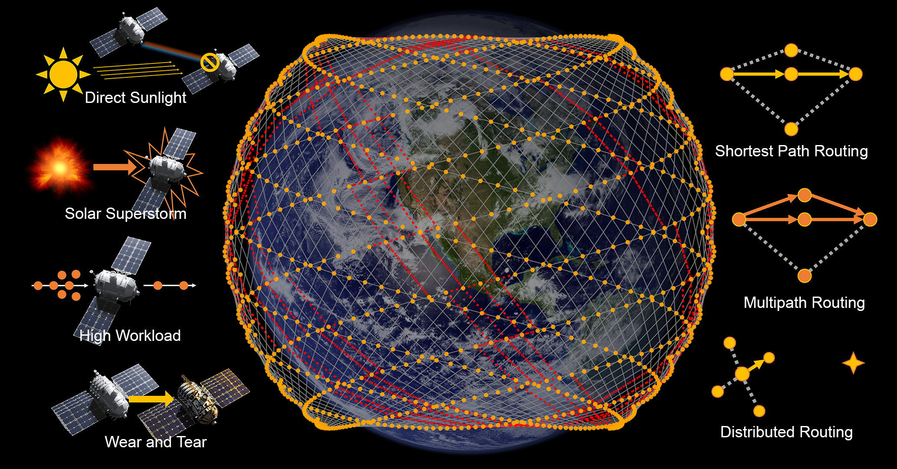

# How Resilient Are They? Robustness Analysis of LEO Satellite Routing | IWQoS 2025



This is the code base for the IWQoS 2025 paper "How Resilient Are They? Robustness Analysis of LEO Satellite Routing."

Zijun Yang, Sheng Cen and Yifei Zhu

UM-SJTU Joint Institute, Shanghai Jiao Tong University

---

In this work, we conduct the first comprehensive robustness analysis of LEO satellite routing under four critical space-environment threats: direct sunlight interference, solar superstorms, high-latitude workload congestion, and batch satellite failures from wear and tear. Our findings reveal that static routing algorithms exhibit catastrophic vulnerabilities, while dynamic distributed routing maintains network resilience with minimal latency trade-offs, providing fundamental insights for designing adaptive satellite network infrastructures.

We use C++ to simulate the constellation and output the results to CSV files. Python is then used to visualize them.

You may find some unused code in Python since it was originally designed to use Python only for the entire work, but it turned out to be too slow for the scale of the simulation we're doing.

# Run the Code - Simulation

This project uses CMake.

```bash
mkdir build
cd build
cmake ..
make break
make city
```

The constellation settings are hard-coded in `break.cpp` and `city.cpp`.

`break.cpp` is used for macroscopic, constellation-scale simulation.

`city.cpp` is used for microscopic, city pair connectivity simulation.

You can run them directly and follow the prompts. Before running, you should set up the subfolder like `/results/resultsXX/`.

# Run the Code - Visualization

Required Python packages are in `requirements.txt`.

The constellation settings are in `/config/`.

Before plotting any macroscopic constellation-scale simulation, you should run `python3 integrateCsv.py` to integrate the results.

## Plot ISL and Satellite 2D Map

```bash
python3 plotMap.py
```

Uncomment ISL disruption code to plot different scenarios.

## Plot Disconnection Rate in the Direct Sunlight Scenario

```bash
python3 plotFailureRateWithTime.py
```

Uncomment `dirList` and `legends` code to plot different phase shift settings.

If you want to visualize your own results, change `dirList` to the corresponding result postfix and legends accordingly.

## Plot Disconnection Rate in the Other Three Scenarios

```bash
python3 plotFailureRateWithISLFailureRate.py
```

Uncomment `dirList` and `legends` code to plot different scenarios.

If you want to visualize your own results, change `dirList` to the corresponding result postfix and legends accordingly.

## Plot Microscopic View (City Pairwise Connectivity)

```bash
python3 plotCity.py
```

For the plots appearing in the paper, the following parameters are used:

- Solar superstorm: `dir=95`, `only6000s=1`, and ISL failure rate=`5`.
- High workload: `dir=96`, `only6000s=1`, and ISL failure rate=`5`.
- Wear and tear: `dir=92`, `only6000s=0`, and ISL failure rate=`5`.

If you want to visualize your own results, input your result postfix and ISL failure rate. If `only6000s` is set to a value other than `1`, it will try to plot all the data.

# Pitfalls

The program uses a slightly different set of terminology compared to the paper.

Phase shift in the paper is the phase difference between neighboring orbits. This parameter in the program (both Python and C++) is named `offset`, and it is multiplied by `-72` so that it is an integer. For example, an offset of `-11` in the program is the same as a phase shift of `11/72` in the paper.

# License

`all_in_one.csv` and `all_in_one_real_csv.csv` are processed data originally from Oakla Speedtest and the United Nations. 

<a href="https://github.com/zpatronus/Robustness-Analysis-of-LEO-Satellite-Routing">Code base for the paper "How Resilient Are They? Robustness Analysis of LEO Satellite Routing"</a> © 2025 by <a href="https://zjyang.dev/">Zijun Yang</a> is licensed under <a href="https://creativecommons.org/licenses/by/4.0/">CC BY 4.0</a>

# Citation Format

Z. Yang, S. Cen, and Y. Zhu, "How Resilient Are They? Robustness Analysis of LEO Satellite Routing," in *Proc. IEEE/ACM International Symposium on Quality of Service (IWQoS)*, 2025.

```bibtex
@inproceedings{yang2025resilient,
  title={How Resilient Are They? Robustness Analysis of LEO Satellite Routing},
  author={Yang, Zijun and Cen, Sheng and Zhu, Yifei},
  booktitle={Proc. IEEE/ACM International Symposium on Quality of Service (IWQoS)},
  year={2025},
  publisher={IEEE/ACM}
}
```
